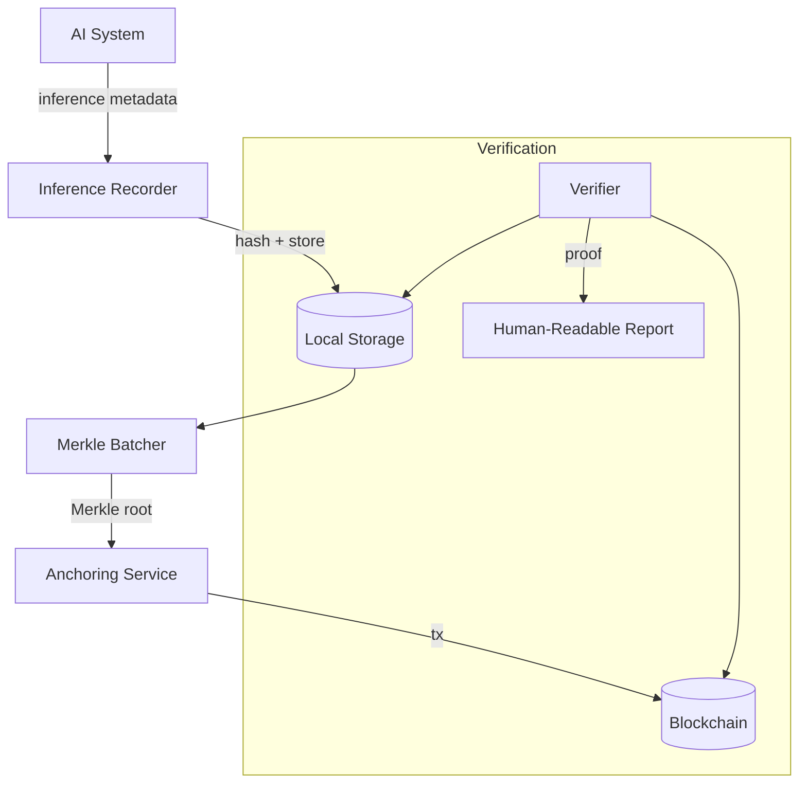

# AiProofTrace Architecture

An infrastructure tool for verifiable AI inference logs using blockchain anchoring.

## System Overview

AiProofTrace follows a modular architecture designed for verifiability and auditability.

## System Components

### 1. ProofTraceRegistry Smart Contract
A minimal on-chain registry that stores Merkle roots and their anchor timestamps. It prevents duplicate anchors and provides the ultimate source of truth for proof-of-existence.

### 2. Inference Recorder (API)
Accepts inference metadata (model, prompt hash, output hash, parameters, context). It canonicalizes the payload to ensure deterministic hashing and stores the record locally.

### 3. Merkle Batch Builder
Groups multiple inference hashes into a Merkle batch. It uses sorted-pair hashing to ensure the Merkle root is deterministic regardless of the order in which hashes are added to the batch (once the set is fixed).

### 4. Anchoring Service
Submits Merkle roots to the smart contract on supported chains (Base, Sepolia). It tracks transaction status and records block numbers and timestamps.

### 5. Verification Engine
Recomputes hashes, reconstructs Merkle proofs, and verifies them against the on-chain registry. It generates human-readable reports explaining what is and isn't proven.

---

## Technical Details

### Deterministic Hashing
All metadata is canonicalized:
- Keys are sorted alphabetically.
- No undefined values.
- Consistent formatting (no whitespace).
- Hashed using keccak256.

### Merkle Tree Construction
- Sorted leaves for deterministic roots.
- Efficient proof generation for individual leaf verification.
- Pairwise hashing using keccak256.

### Verification Logic
Verification follows a multi-step process:
1. **Hash Re-computation**: The local record is re-hashed to check integrity.
2. **Batch Inclusion**: The record is checked against stored Merkle batches.
3. **Proof Verification**: A Merkle proof is generated and verified against the Merkle root.
4. **On-Chain Audit**: The Merkle root is checked against the blockchain registry to confirm the anchor block and timestamp.
